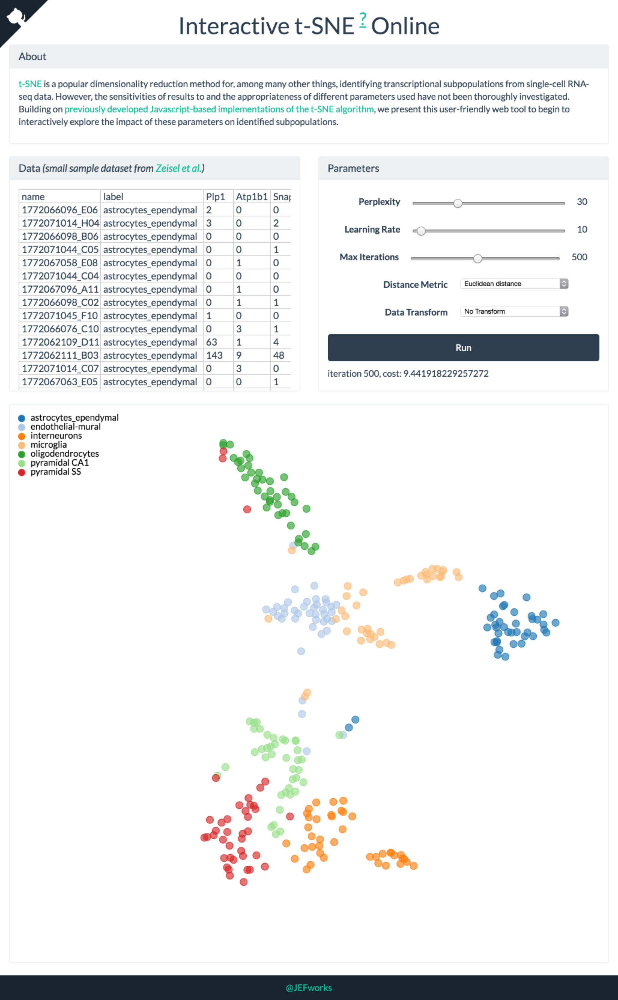

[t-SNE](http://lvdmaaten.github.io/tsne/) is a popular dimensionality reduction method for, among many other things, identifying transcriptional subpopulations from single-cell RNA-seq data. However, the sensitivities of results to and the appropriateness of different parameters used have not been thoroughly investigated. Building on [previously developed Javascript-based implementations of the t-SNE algorithm](https://github.com/karpathy/tsnejs), we present this user-friendly web tool to begin to interactively explore the impact of these parameters on identified subpopulations.

# Try it out ☞ [jefworks.github.io/tsne/](http://jefworks.github.io/tsne/)

